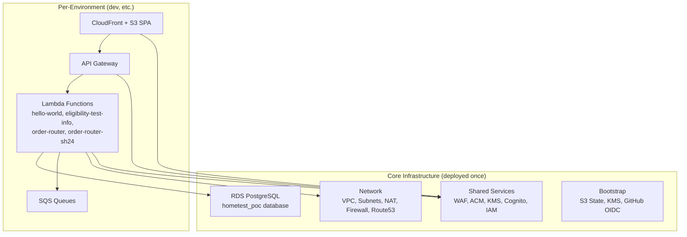

# NHS HomeTest Management Terraform

Infrastructure as Code (IaC) for the NHS HomeTest Service using Terraform and Terragrunt for multi-environment AWS deployments.

## Table of Contents

- [NHS HomeTest Management Terraform](#nhs-hometest-management-terraform)
  - [Table of Contents](#table-of-contents)
  - [Overview](#overview)
  - [Architecture](#architecture)
  - [Prerequisites](#prerequisites)
  - [AWS SSO Setup](#aws-sso-setup)
  - [Getting Started](#getting-started)
  - [Infrastructure Components](#infrastructure-components)
  - [Deployment](#deployment)
  - [Development Tools](#development-tools)
  - [Documentation](#documentation)
  - [Licence](#licence)

## Overview

This repository manages the AWS infrastructure for the NHS HomeTest Service, including:

- **Bootstrap** — Terraform state backend (S3 + KMS) and GitHub OIDC for CI/CD
- **Networking** — VPC, subnets, NAT gateways, Network Firewall, VPC endpoints, Route53
- **Shared Services** — WAF, ACM certificates, KMS, Cognito, IAM roles
- **RDS PostgreSQL** — Managed database for the HomeTest application
- **HomeTest Application** — Lambda functions, API Gateway, CloudFront + S3 SPA, SQS queues

## Architecture



## Prerequisites

The following tools are managed via [mise](https://github.com/jdx/mise) (see [.mise.toml](.mise.toml)):

| Tool | Version | Purpose |
|------|---------|---------|
| **Terraform** | 1.14.4 | Infrastructure provisioning |
| **Terragrunt** | 0.99.1 | DRY Terraform configuration |
| **AWS CLI** | 2.33.13 | AWS interaction |
| **TFLint** | latest | Terraform linting |
| **terraform-docs** | latest | Auto-generated documentation |
| **Trivy** | latest | Security scanning |
| **Checkov** | latest | Policy-as-code scanning |
| **Gitleaks** | 8.18.4 | Secret scanning |
| **pre-commit** | latest | Git hooks |

Additional requirements:

- [Docker](https://www.docker.com/) or compatible container runtime
- [GNU Make](https://www.gnu.org/software/make/) 3.82+
- [Python](https://www.python.org/) (for Git hooks)
- [jq](https://jqlang.github.io/jq/) (JSON processing)
- Firefox with [AWS SSO Containers](https://addons.mozilla.org/en-US/firefox/addon/aws-sso-containers/) (optional, for multi-account browser management)

Install all tool versions:

```bash
mise install
```

## AWS SSO Setup

```bash
aws configure sso

# Resulting ~/.aws/config profile:
# [profile Admin-PoC]
# sso_session = nhs
# sso_account_id = 781863586270
# sso_role_name = Admin
# region = eu-west-2
#
# [sso-session nhs]
# sso_start_url = https://d-9c67018f89.awsapps.com/start/#
# sso_region = eu-west-2
# sso_registration_scopes = sso:account:access

aws sso login --profile Admin-PoC
export AWS_PROFILE=Admin-PoC
```

## Getting Started

```bash
# Clone the repository
git clone https://github.com/NHSDigital/hometest-mgmt-terraform.git
cd hometest-mgmt-terraform

# Install tool versions
mise install

# Configure pre-commit hooks and development dependencies
make config
```

## Infrastructure Components

See [infrastructure/README.md](./infrastructure/README.md) for the full infrastructure guide including:

- Directory structure and module documentation
- Deployment order and dependencies
- Security features (WAF, KMS, VPC, Network Firewall)
- Troubleshooting guide

### Key Directories

| Directory | Purpose |
|-----------|---------|
| `infrastructure/src/` | Terraform root modules (bootstrap, network, shared_services, rds-postgres, hometest-app) |
| `infrastructure/modules/` | Reusable Terraform modules (api-gateway, cloudfront-spa, lambda, lambda-iam, rds-postgres, waf, etc.) |
| `infrastructure/environments/` | Terragrunt environment configurations (poc/core, poc/dev) |
| `scripts/` | Build, test, and deployment helper scripts |
| `docs/` | ADRs, developer guides, diagrams, user guides |
| `.github/workflows/` | CI/CD pipelines |

## Deployment

### Quick Deploy

```bash
# 1. Bootstrap (first time only — creates state backend)
cd infrastructure/src/bootstrap
terraform init && terraform apply

# 2. Deploy core (network → shared_services → rds-postgres)
cd infrastructure/environments/poc/core/network
terragrunt apply

cd ../shared_services
terragrunt apply

cd ../rds-postgres
terragrunt apply

# 3. Deploy application environment
cd ../../dev/hometest-app
terragrunt apply
```

### Deploy All

```bash
cd infrastructure/environments/poc
terragrunt run-all apply
```

## Development Tools

### Pre-commit Hooks

Configured in [.pre-commit-config.yaml](.pre-commit-config.yaml):

- `terraform_fmt` / `terragrunt_fmt` — formatting
- `terraform_tflint` — linting
- `terraform_trivy` — security scanning
- `terraform_checkov` — policy-as-code
- `terraform_docs` — auto-generate module docs
- `gitleaks` — secret detection
- `markdownlint` — Markdown linting

```bash
# Run all checks
pre-commit run --all-files

# Or via mise task
mise run pre-commit
```

### Testing

```bash
make test
```

## Documentation

- [Infrastructure Guide](./infrastructure/README.md) — full infrastructure documentation
- [Creating a New Environment](./docs/developer-guides/Creating_New_Environment.md) — step-by-step guide
- [Developer Guides](./docs/developer-guides/) — Bash/Make, Docker, Terraform scripting
- [User Guides](./docs/user-guides/) — static analysis, Git hooks, secrets scanning
- [ADRs](./docs/adr/) — architecture decision records

### External Resources

- [Terragrunt Live Stacks Example](https://github.com/gruntwork-io/terragrunt-infrastructure-live-stacks-example/blob/main/root.hcl)
- [Terragrunt Catalog Example](https://github.com/gruntwork-io/terragrunt-infrastructure-catalog-example/blob/main/stacks/ec2-asg-stateful-service/terragrunt.stack.hcl)
- [mise Version Manager](https://github.com/jdx/mise)
- [NHS AWS SSO User Access](https://nhsd-confluence.digital.nhs.uk/spaces/AWS/pages/592551759/AWS+Single+Sign+on+SSO+User+Access)

## Licence

Unless stated otherwise, the codebase is released under the MIT License. This covers both the codebase and any sample code in the documentation.

Any HTML or Markdown documentation is [© Crown Copyright](https://www.nationalarchives.gov.uk/information-management/re-using-public-sector-information/uk-government-licensing-framework/crown-copyright/) and available under the terms of the [Open Government Licence v3.0](https://www.nationalarchives.gov.uk/doc/open-government-licence/version/3/).
