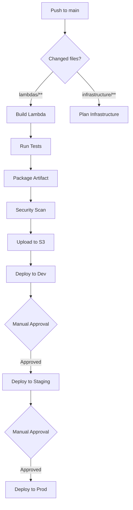

# CI/CD Pipeline Documentation

This document describes the CI/CD pipeline for building and deploying Lambda functions from the [hometest-service](https://github.com/NHSDigital/hometest-service) repository.

## Overview

The pipeline follows a multi-stage approach:

```text
┌─────────────────┐     ┌─────────────────┐     ┌─────────────────┐     ┌─────────────────┐
│   Clone Repo    │────▶│  Build & Test   │────▶│  Upload to S3   │────▶│ Deploy Lambda   │
│ hometest-service│     │   TypeScript    │     │   Artifacts     │     │   via Terraform │
└─────────────────┘     └─────────────────┘     └─────────────────┘     └─────────────────┘
```

## GitHub Actions Workflows

### 1. Lambda Build and Deploy (`lambda-build-deploy.yaml`)

**Full pipeline** - Clones, builds, uploads, and deploys in one workflow.

**Triggers:**

- Manual dispatch with environment selection
- Push to `main` branch (changes in `lambdas/` directory)

**Inputs:**

| Input | Description | Default |
|-------|-------------|---------|
| `environment` | Target environment (dev/staging/prod) | `dev` |
| `account` | AWS account (poc/prod) | `poc` |
| `service_ref` | Git ref from hometest-service | `main` |
| `skip_deploy` | Build only, skip Terraform | `false` |

**Usage:**

```bash
# Via GitHub UI: Actions → Lambda Build and Deploy → Run workflow
```

### 2. Build Stage (`stage-3-build.yaml`)

**Reusable workflow** - Called by other pipelines to build Lambda artifacts.

**Outputs:**

- `artifact_name` - Name of the built artifact
- `artifact_hash` - SHA256 hash for Terraform `source_code_hash`
- `s3_key` - S3 object key for the artifact

### 3. Deploy (`cicd-3-deploy.yaml`)

**Deployment only** - Deploys an existing artifact from S3.

**Inputs:**

| Input | Description | Default |
|-------|-------------|---------|
| `tag` | Artifact version or "latest" | `latest` |
| `environment` | Target environment | `dev` |
| `account` | AWS account | `poc` |

## Local Development

### Prerequisites

- Node.js 20+
- AWS CLI configured with appropriate profile
- Terraform 1.14+
- Terragrunt 0.97+

### Makefile Commands

```bash
# Clone hometest-service repository
make clone-service SERVICE_REF=main

# Build Lambda from hometest-service
make build-service

# Package Lambda as zip
make package-service

# Upload to S3
make upload-service ENV=dev ACCOUNT=poc

# Full deploy (build + upload + terraform apply)
make deploy-service ENV=dev ACCOUNT=poc

# Clean up cloned repository
make clean-service
```

### Environment Variables

| Variable | Description | Default |
|----------|-------------|---------|
| `ENV` | Target environment | `dev` |
| `ACCOUNT` | AWS account | `poc` |
| `SERVICE_REF` | Git ref for hometest-service | `main` |
| `AWS_PROFILE` | AWS CLI profile | `Admin-PoC` |

## Required GitHub Secrets

Configure these secrets in your GitHub repository:

| Secret | Description |
|--------|-------------|
| `SERVICE_REPO_TOKEN` | GitHub PAT with access to NHSDigital/hometest-service |
| `AWS_DEPLOY_ROLE_ARN` | ARN of IAM role for GitHub Actions OIDC |
| `TEAMS_NOTIFICATION_WEBHOOK_URL` | (Optional) MS Teams webhook for notifications |

## AWS IAM Role for GitHub Actions

Create an IAM role with OIDC trust policy for GitHub Actions:

```hcl
resource "aws_iam_role" "github_actions" {
  name = "github-actions-deploy"

  assume_role_policy = jsonencode({
    Version = "2012-10-17"
    Statement = [
      {
        Effect = "Allow"
        Principal = {
          Federated = "arn:aws:iam::${account_id}:oidc-provider/token.actions.githubusercontent.com"
        }
        Action = "sts:AssumeRoleWithWebIdentity"
        Condition = {
          StringEquals = {
            "token.actions.githubusercontent.com:aud" = "sts.amazonaws.com"
          }
          StringLike = {
            "token.actions.githubusercontent.com:sub" = "repo:NHSDigital/hometest-mgmt-terraform:*"
          }
        }
      }
    ]
  })
}
```

## Artifact Naming Convention

Artifacts follow this naming pattern:

```text
lambda-api-<version>-<timestamp>.zip
```

Example: `lambda-api-0.0.1-20260127143022.zip`

## Troubleshooting

### Build Fails - "Cannot find module"

Ensure the hometest-service repository has a valid `package-lock.json`:

```bash
cd .hometest-service/lambdas
rm -rf node_modules package-lock.json
npm install
```

### Deploy Fails - "Bucket does not exist"

The S3 bucket for artifacts is created by Terraform. Ensure the application module is deployed first:

```bash
make tf-apply ENV=dev
```

### Lambda Returns 500 After Deploy

Force a new API Gateway deployment:

```bash
aws apigateway create-deployment \
  --rest-api-id <api-id> \
  --stage-name v1 \
  --description "Force redeploy"
```

## Pipeline Flow Diagram



## Related Documentation

- [Terraform Modules](../infrastructure/src/README.md)
- [Environment Configuration](../infrastructure/environments/README.md)
- [hometest-service Repository](https://github.com/NHSDigital/hometest-service)
