# Network Infrastructure Module

This module provisions a centralized, production-ready VPC infrastructure following AWS Well-Architected Framework best practices, specifically designed for Lambda-based serverless workloads with advanced egress filtering capabilities.

## Network Flow Diagrams (Mermaid)

### Inbound Traffic Flow - Internet to Lambda

```mermaid
flowchart TB
    subgraph Internet
        User[("👤 User/Client")]
    end

    subgraph Edge["Edge Layer"]
        R53[("🌐 Route 53<br/>DNS + DNSSEC")]
        CF["☁️ CloudFront<br/>(Optional CDN)"]
        WAF["🛡️ AWS WAF<br/>Rate Limit | SQL/XSS | Geo-Block"]
    end

    subgraph API["API Layer"]
        APIGW["🚪 API Gateway<br/>HTTP API + Custom Domain"]
        ACM["🔒 ACM Certificate<br/>TLS/SSL"]
    end

    subgraph VPC["VPC (10.0.0.0/16)"]
        subgraph PrivateSubnets["Private Subnets"]
            VPCL["🔗 VPC Link"]
            SG["🔐 Security Group"]
            Lambda["⚡ Lambda Function"]
        end

        subgraph DataSubnets["Data Subnets (Isolated)"]
            RDS[("🗄️ RDS Database")]
            Redis[("💾 ElastiCache")]
        end
    end

    User -->|"HTTPS Request"| R53
    R53 -->|"DNS Resolution"| CF
    CF -->|"Origin Request"| WAF
    WAF -->|"Allowed Traffic"| APIGW
    APIGW -.->|"TLS Termination"| ACM
    APIGW -->|"VPC Link"| VPCL
    VPCL --> SG
    SG --> Lambda
    Lambda -->|"Private Connection"| RDS
    Lambda -->|"Private Connection"| Redis

    style WAF fill:#ff6b6b,color:#fff
    style Lambda fill:#ff9900,color:#fff
    style RDS fill:#3b48cc,color:#fff
    style R53 fill:#8c4fff,color:#fff
    style APIGW fill:#ff4f8b,color:#fff
```



### Outbound Traffic Flow - Lambda to Internet (with Network Firewall)


### VPC Endpoint Traffic Flow


### Security Layers


### Complete Request Lifecycle

```mermaid
sequenceDiagram
    participant User as 👤 User
    participant R53 as 🌐 Route 53
    participant WAF as 🛡️ WAF
    participant APIGW as 🚪 API Gateway
    participant Lambda as ⚡ Lambda
    participant RDS as 🗄️ RDS
    participant NFW as 🔥 Network Firewall
    participant External as 🌍 External API

    User->>R53: 1. DNS Lookup (hometest.service.nhs.org)
    R53-->>User: 2. Return API Gateway endpoint
    User->>WAF: 3. HTTPS Request

    alt Request Blocked
        WAF-->>User: 4a. 403 Forbidden (Rate limit/Attack detected)
    else Request Allowed
        WAF->>APIGW: 4b. Forward Request
        APIGW->>Lambda: 5. Invoke via VPC Link
        Lambda->>RDS: 6. Query Database (Private)
        RDS-->>Lambda: 7. Return Data

        opt External API Call
            Lambda->>NFW: 8. Outbound Request
            alt Allowed Destination
                NFW->>External: 9a. Forward (Allowed IP/Domain)
                External-->>Lambda: 10. Response
            else Blocked Destination
                NFW-->>Lambda: 9b. Connection Dropped
            end
        end

        Lambda-->>APIGW: 11. Return Response
        APIGW-->>User: 12. HTTPS Response
    end
```



## Architecture Overview

### Standard Architecture (Without Network Firewall)

```
┌─────────────────────────────────────────────────────────────────────────────┐
│                                  VPC                                         │
│                            (10.0.0.0/16)                                     │
│                                                                              │
│  ┌─────────────────────────────────────────────────────────────────────────┐ │
│  │                        PUBLIC SUBNETS                                    │ │
│  │   ┌──────────────┐  ┌──────────────┐  ┌──────────────┐                  │ │
│  │   │   AZ-1       │  │   AZ-2       │  │   AZ-3       │                  │ │
│  │   │ 10.0.0.0/20  │  │ 10.0.16.0/20 │  │ 10.0.32.0/20 │                  │ │
│  │   │  [NAT GW]    │  │  [NAT GW]    │  │  [NAT GW]    │                  │ │
│  │   └──────────────┘  └──────────────┘  └──────────────┘                  │ │
│  └─────────────────────────────────────────────────────────────────────────┘ │
│                              ↑                                               │
│                     [Internet Gateway]                                       │
│                                                                              │
│  ┌─────────────────────────────────────────────────────────────────────────┐ │
│  │                       PRIVATE SUBNETS (Lambda)                           │ │
│  │   ┌──────────────┐  ┌──────────────┐  ┌──────────────┐                  │ │
│  │   │   AZ-1       │  │   AZ-2       │  │   AZ-3       │                  │ │
│  │   │ 10.0.64.0/19 │  │ 10.0.96.0/19 │  │ 10.0.128.0/19│                  │ │
│  │   │  [Lambda]    │  │  [Lambda]    │  │  [Lambda]    │                  │ │
│  │   │  [VPC EP]    │  │  [VPC EP]    │  │  [VPC EP]    │                  │ │
│  │   └──────────────┘  └──────────────┘  └──────────────┘                  │ │
│  └─────────────────────────────────────────────────────────────────────────┘ │
│                              ↓                                               │
│  ┌─────────────────────────────────────────────────────────────────────────┐ │
│  │                       DATA SUBNETS (Isolated)                            │ │
│  │   ┌──────────────┐  ┌──────────────┐  ┌──────────────┐                  │ │
│  │   │   AZ-1       │  │   AZ-2       │  │   AZ-3       │                  │ │
│  │   │ 10.0.192.0/21│  │ 10.0.200.0/21│  │ 10.0.208.0/21│                  │ │
│  │   │   [RDS]      │  │   [RDS]      │  │ [ElastiCache]│                  │ │
│  │   └──────────────┘  └──────────────┘  └──────────────┘                  │ │
│  └─────────────────────────────────────────────────────────────────────────┘ │
└─────────────────────────────────────────────────────────────────────────────┘
```

### Architecture with Network Firewall (Egress Filtering Enabled)

```
┌─────────────────────────────────────────────────────────────────────────────┐
│                                  VPC                                         │
│                            (10.0.0.0/16)                                     │
│                                                                              │
│  ┌─────────────────────────────────────────────────────────────────────────┐ │
│  │                       FIREWALL SUBNETS                                   │ │
│  │   ┌──────────────┐  ┌──────────────┐  ┌──────────────┐                  │ │
│  │   │   AZ-1       │  │   AZ-2       │  │   AZ-3       │                  │ │
│  │   │  [FIREWALL]  │  │  [FIREWALL]  │  │  [FIREWALL]  │                  │ │
│  │   │  Endpoint    │  │  Endpoint    │  │  Endpoint    │                  │ │
│  │   └──────────────┘  └──────────────┘  └──────────────┘                  │ │
│  └─────────────────────────────────────────────────────────────────────────┘ │
│                              ↕                                               │
│  ┌─────────────────────────────────────────────────────────────────────────┐ │
│  │                        PUBLIC SUBNETS                                    │ │
│  │   ┌──────────────┐  ┌──────────────┐  ┌──────────────┐                  │ │
│  │   │   AZ-1       │  │   AZ-2       │  │   AZ-3       │                  │ │
│  │   │  [NAT GW]    │  │  [NAT GW]    │  │  [NAT GW]    │                  │ │
│  │   └──────────────┘  └──────────────┘  └──────────────┘                  │ │
│  └─────────────────────────────────────────────────────────────────────────┘ │
│                              ↑                                               │
│                     [Internet Gateway]                                       │
│                                                                              │
│  ┌─────────────────────────────────────────────────────────────────────────┐ │
│  │                       PRIVATE SUBNETS (Lambda)                           │ │
│  │   ┌──────────────┐  ┌──────────────┐  ┌──────────────┐                  │ │
│  │   │   AZ-1       │  │   AZ-2       │  │   AZ-3       │                  │ │
│  │   │  [Lambda] ───┼──┼──→ Firewall ─┼──┼──→ NAT ──→ Internet             │ │
│  │   │  [VPC EP]    │  │              │  │              │                  │ │
│  │   └──────────────┘  └──────────────┘  └──────────────┘                  │ │
│  └─────────────────────────────────────────────────────────────────────────┘ │
│                              ↓                                               │
│  ┌─────────────────────────────────────────────────────────────────────────┐ │
│  │                       DATA SUBNETS (Isolated)                            │ │
│  │   ┌──────────────┐  ┌──────────────┐  ┌──────────────┐                  │ │
│  │   │   [RDS]      │  │   [RDS]      │  │ [ElastiCache]│                  │ │
│  │   └──────────────┘  └──────────────┘  └──────────────┘                  │ │
│  └─────────────────────────────────────────────────────────────────────────┘ │
└─────────────────────────────────────────────────────────────────────────────┘
```

## Features

### Security (AWS Well-Architected - Security Pillar)

- **VPC Flow Logs**: All network traffic logged to CloudWatch with KMS encryption
- **Network ACLs**: Additional layer of defense at subnet level
- **Security Groups**: Principle of least privilege for Lambda, RDS, and ElastiCache
- **Private Subnets**: Lambda functions deployed in private subnets without direct internet access
- **Isolated Data Tier**: Database subnets with no internet routes
- **Encrypted Logging**: VPC Flow Logs encrypted with customer-managed KMS key
- **AWS Network Firewall**: Deep packet inspection and egress filtering to specific IPs/domains
- **Default Deny**: Optional default deny policy - only explicitly allowed traffic passes

### Reliability (AWS Well-Architected - Reliability Pillar)

- **Multi-AZ Deployment**: Resources spread across 3 Availability Zones
- **Redundant NAT Gateways**: One NAT Gateway per AZ for high availability (configurable)
- **Redundant Firewall Endpoints**: One firewall endpoint per AZ
- **Fault Isolation**: Separate route tables per AZ for NAT Gateway failover isolation

### Performance Efficiency (AWS Well-Architected - Performance Pillar)

- **VPC Endpoints**: Gateway and Interface endpoints to reduce latency and NAT costs
- **Optimized Routing**: Direct routes to AWS services via VPC endpoints

### Cost Optimization (AWS Well-Architected - Cost Pillar)

- **Gateway Endpoints**: Free S3 and DynamoDB endpoints
- **Single NAT Option**: Configurable single NAT Gateway for non-production environments
- **Right-sized Subnets**: CIDR allocation optimized for Lambda workloads

## Network Firewall & Egress Filtering

When `enable_network_firewall = true`, AWS Network Firewall is deployed for advanced egress filtering:

### Features
- **IP-based filtering**: Allow traffic only to specific IP addresses/CIDRs
- **Domain-based filtering**: Allow HTTPS/TLS traffic only to specific domains (SNI inspection)
- **Default deny**: Optional policy to drop all traffic not explicitly allowed
- **Deep packet inspection**: Stateful inspection of all egress traffic
- **Centralized logging**: All firewall decisions logged to CloudWatch

### Rule Evaluation Order (Strict Order)
1. **AWS Services** (Priority 100): `.amazonaws.com`, `.aws.amazon.com` - Always allowed
2. **Allowed IPs** (Priority 200): Custom IP/CIDR list from `allowed_egress_ips`
3. **Allowed Domains** (Priority 300): Custom domain list from `allowed_egress_domains`
4. **Default Deny** (Priority 65535): Drop all other traffic (when enabled)

### Example Configuration

```hcl
enable_network_firewall = true
firewall_default_deny   = true

# Allow specific IP addresses
allowed_egress_ips = [
  {
    ip          = "203.0.113.10/32"
    port        = "443"
    protocol    = "TCP"
    description = "External Payment API"
  },
  {
    ip          = "198.51.100.0/24"
    port        = "443"
    protocol    = "TCP"
    description = "Partner Network"
  }
]

# Allow specific domains
allowed_egress_domains = [
  ".nhs.uk",
  ".gov.uk",
  "api.stripe.com",
  ".github.com"
]
```

## VPC Endpoints

### Gateway Endpoints (Free)
- S3
- DynamoDB

### Interface Endpoints (Configurable)
- Lambda
- API Gateway (execute-api)
- Secrets Manager
- Systems Manager (SSM, SSM Messages, EC2 Messages)
- CloudWatch Logs & Monitoring
- SQS, SNS
- KMS, STS
- ECR (API and Docker Registry)

## Usage

### Using Lambda VPC Configuration Output

```hcl
# In your Lambda module
resource "aws_lambda_function" "example" {
  function_name = "my-function"
  # ... other configuration

  vpc_config {
    subnet_ids         = module.network.lambda_vpc_config.subnet_ids
    security_group_ids = module.network.lambda_vpc_config.security_group_ids
  }
}
```

### Using Individual Outputs

```hcl
resource "aws_lambda_function" "example" {
  function_name = "my-function"
  # ... other configuration

  vpc_config {
    subnet_ids         = module.network.private_subnet_ids
    security_group_ids = [module.network.lambda_security_group_id]
  }
}
```

## Inputs

| Name | Description | Type | Default | Required |
|------|-------------|------|---------|:--------:|
| aws_region | AWS region for resources | `string` | n/a | yes |
| aws_account_id | AWS account ID | `string` | n/a | yes |
| aws_account_shortname | AWS account short name for resource naming | `string` | n/a | yes |
| project_name | Project name for resource naming | `string` | n/a | yes |
| environment | Environment name (mgmt, dev, staging, prod) | `string` | n/a | yes |
| vpc_cidr | CIDR block for the VPC | `string` | `"10.0.0.0/16"` | no |
| az_count | Number of Availability Zones (2-3) | `number` | `3` | no |
| enable_ipv6 | Enable IPv6 dual-stack | `bool` | `false` | no |
| single_nat_gateway | Use single NAT Gateway (cost savings) | `bool` | `false` | no |
| flow_logs_retention_days | VPC Flow Logs retention period | `number` | `90` | no |
| enable_interface_endpoints | Enable VPC Interface Endpoints | `bool` | `true` | no |
| interface_endpoints | List of AWS services for Interface Endpoints | `list(string)` | See variables.tf | no |
| create_db_subnet_group | Create DB subnet group | `bool` | `true` | no |
| create_lambda_rds_sg | Create Lambda-to-RDS security group | `bool` | `true` | no |
| create_rds_sg | Create RDS security group | `bool` | `true` | no |
| create_elasticache_sg | Create ElastiCache security group | `bool` | `true` | no |
| tags | Additional tags for all resources | `map(string)` | `{}` | no |

## Outputs

| Name | Description |
|------|-------------|
| vpc_id | The ID of the VPC |
| vpc_cidr_block | The CIDR block of the VPC |
| public_subnet_ids | List of public subnet IDs |
| private_subnet_ids | List of private subnet IDs (for Lambda) |
| data_subnet_ids | List of data/database subnet IDs |
| lambda_security_group_id | Security group ID for Lambda functions |
| lambda_vpc_config | Ready-to-use VPC config for Lambda functions |
| db_subnet_group_name | Name of the DB subnet group |
| nat_gateway_public_ips | NAT Gateway public IP addresses |
| network_firewall_id | ID of the Network Firewall (when enabled) |
| network_firewall_arn | ARN of the Network Firewall |
| firewall_subnet_ids | List of firewall subnet IDs |
| egress_filtering_config | Summary of egress filtering configuration |

## Best Practices Implemented

1. **Never expose Lambda directly to the internet** - Use API Gateway or ALB
2. **Use VPC Endpoints** - Reduce NAT Gateway costs and improve security
3. **Enable VPC Flow Logs** - Required for security compliance and troubleshooting
4. **Encrypt everything** - KMS encryption for logs and data at rest
5. **Least privilege security groups** - Only allow required traffic
6. **Multi-AZ for HA** - Distribute across availability zones
7. **Separate route tables** - Isolate failure domains
8. **Egress filtering** - Use Network Firewall to control outbound traffic
9. **Default deny** - Drop traffic not explicitly allowed
10. **Domain-based filtering** - Control which external services can be accessed

## Cost Considerations

| Resource | Cost Impact | Optimization |
|----------|-------------|--------------|
| NAT Gateway | ~$32/month + data processing | Use single NAT for dev/staging |
| Interface Endpoints | ~$7/month each | Only enable needed services |
| VPC Flow Logs | CloudWatch Logs ingestion costs | Adjust retention period |
| Network Firewall | ~$0.395/hour per endpoint (~$850/month for 3 AZs) | Disable for non-production |
| Firewall Data Processing | $0.065/GB | Optimize traffic patterns |

## Requirements

| Name | Version |
|------|---------|
| terraform | >= 1.14.0 |
| aws | ~> 6.28.0 |
