# Network Infrastructure Module

This module provisions a centralized, production-ready VPC infrastructure following AWS Well-Architected Framework best practices, specifically designed for Lambda-based serverless workloads with advanced egress filtering capabilities.

## Network Flow Diagrams (Mermaid)

### Inbound Traffic Flow - Internet to Lambda

```mermaid
flowchart TB
    subgraph Internet
        User[("👤 User/Client")]
    end

    subgraph Edge["Edge Layer"]
        R53[("🌐 Route 53<br/>DNS + DNSSEC")]
        CF["☁️ CloudFront<br/>(Optional CDN)"]
        WAF["🛡️ AWS WAF<br/>Rate Limit | SQL/XSS | Geo-Block"]
    end

    subgraph API["API Layer"]
        APIGW["🚪 API Gateway<br/>HTTP API + Custom Domain"]
        ACM["🔒 ACM Certificate<br/>TLS/SSL"]
    end

    subgraph VPC["VPC (10.0.0.0/16)"]
        subgraph PrivateSubnets["Private Subnets"]
            VPCL["🔗 VPC Link"]
            SG["🔐 Security Group"]
            Lambda["⚡ Lambda Function"]
        end

        subgraph DataSubnets["Data Subnets (Isolated)"]
            Aurora[("🗄️ Aurora Database")]
            Redis[("💾 ElastiCache")]
        end
    end

    User -->|"HTTPS Request"| R53
    R53 -->|"DNS Resolution"| CF
    CF -->|"Origin Request"| WAF
    WAF -->|"Allowed Traffic"| APIGW
    APIGW -.->|"TLS Termination"| ACM
    APIGW -->|"VPC Link"| VPCL
    VPCL --> SG
    SG --> Lambda
    Lambda -->|"Private Connection"| Aurora
    Lambda -->|"Private Connection"| Redis

    style WAF fill:#ff6b6b,color:#fff
    style Lambda fill:#ff9900,color:#fff
    style Aurora fill:#3b48cc,color:#fff
    style R53 fill:#8c4fff,color:#fff
    style APIGW fill:#ff4f8b,color:#fff
```



### Outbound Traffic Flow - Lambda to Internet (with Network Firewall)

```mermaid
flowchart LR
    subgraph VPC["VPC"]
        subgraph Private["Private Subnet"]
            Lambda["⚡ Lambda"]
        end

        subgraph Firewall["Firewall Subnet"]
            NFW["🔥 Network Firewall<br/>Egress Filtering"]
        end

        subgraph Public["Public Subnet"]
            NAT["🌐 NAT Gateway"]
        end

        IGW["🚪 Internet Gateway"]
    end

    subgraph External["Allowed Destinations"]
        AWS["☁️ AWS Services<br/>(.amazonaws.com)"]
        Allowed["✅ Allowed IPs/Domains<br/>(.nhs.uk, .gov.uk)"]
        Blocked["❌ Blocked Traffic"]
    end

    Lambda -->|"1. Egress Request"| NFW
    NFW -->|"2. Inspect & Filter"| NAT
    NFW -.->|"Blocked"| Blocked
    NAT -->|"3. NAT Translation"| IGW
    IGW -->|"4. Internet"| AWS
    IGW -->|"4. Internet"| Allowed

    style NFW fill:#ff6b6b,color:#fff
    style Lambda fill:#ff9900,color:#fff
    style Blocked fill:#666,color:#fff
    style Allowed fill:#00b894,color:#fff
```



### VPC Endpoint Traffic Flow


### Security Layers


### Complete Request Lifecycle

```mermaid
sequenceDiagram
    participant User as 👤 User
    participant R53 as 🌐 Route 53
    participant WAF as 🛡️ WAF
    participant APIGW as 🚪 API Gateway
    participant Lambda as ⚡ Lambda
    participant Aurora as 🗄️ Aurora
    participant NFW as 🔥 Network Firewall
    participant External as 🌍 External API

    User->>R53: 1. DNS Lookup (hometest.service.nhs.org)
    R53-->>User: 2. Return API Gateway endpoint
    User->>WAF: 3. HTTPS Request

    alt Request Blocked
        WAF-->>User: 4a. 403 Forbidden (Rate limit/Attack detected)
    else Request Allowed
        WAF->>APIGW: 4b. Forward Request
        APIGW->>Lambda: 5. Invoke via VPC Link
        Lambda->>Aurora: 6. Query Database (Private)
        Aurora-->>Lambda: 7. Return Data

        opt External API Call
            Lambda->>NFW: 8. Outbound Request
            alt Allowed Destination
                NFW->>External: 9a. Forward (Allowed IP/Domain)
                External-->>Lambda: 10. Response
            else Blocked Destination
                NFW-->>Lambda: 9b. Connection Dropped
            end
        end

        Lambda-->>APIGW: 11. Return Response
        APIGW-->>User: 12. HTTPS Response
    end
```



## Architecture Overview

### Standard Architecture (Without Network Firewall)

```
┌─────────────────────────────────────────────────────────────────────────────┐
│                                  VPC                                         │
│                            (10.0.0.0/16)                                     │
│                                                                              │
│  ┌─────────────────────────────────────────────────────────────────────────┐ │
│  │                        PUBLIC SUBNETS                                    │ │
│  │   ┌──────────────┐  ┌──────────────┐  ┌──────────────┐                  │ │
│  │   │   AZ-1       │  │   AZ-2       │  │   AZ-3       │                  │ │
│  │   │ 10.0.0.0/20  │  │ 10.0.16.0/20 │  │ 10.0.32.0/20 │                  │ │
│  │   │  [NAT GW]    │  │  [NAT GW]    │  │  [NAT GW]    │                  │ │
│  │   └──────────────┘  └──────────────┘  └──────────────┘                  │ │
│  └─────────────────────────────────────────────────────────────────────────┘ │
│                              ↑                                               │
│                     [Internet Gateway]                                       │
│                                                                              │
│  ┌─────────────────────────────────────────────────────────────────────────┐ │
│  │                       PRIVATE SUBNETS (Lambda)                           │ │
│  │   ┌──────────────┐  ┌──────────────┐  ┌──────────────┐                  │ │
│  │   │   AZ-1       │  │   AZ-2       │  │   AZ-3       │                  │ │
│  │   │ 10.0.64.0/19 │  │ 10.0.96.0/19 │  │ 10.0.128.0/19│                  │ │
│  │   │  [Lambda]    │  │  [Lambda]    │  │  [Lambda]    │                  │ │
│  │   │  [VPC EP]    │  │  [VPC EP]    │  │  [VPC EP]    │                  │ │
│  │   └──────────────┘  └──────────────┘  └──────────────┘                  │ │
│  └─────────────────────────────────────────────────────────────────────────┘ │
│                              ↓                                               │
│  ┌─────────────────────────────────────────────────────────────────────────┐ │
│  │                       DATA SUBNETS (Isolated)                           │ │
│  │   ┌──────────────┐  ┌──────────────┐  ┌──────────────┐                  │ │
│  │   │   AZ-1       │  │   AZ-2       │  │   AZ-3       │                  │ │
│  │   │ 10.0.192.0/21│  │ 10.0.200.0/21│  │ 10.0.208.0/21│                  │ │
│  │   │   [Aurora]   │  │   [Aurora]   │  │ [ElastiCache]│                  │ │
│  │   └──────────────┘  └──────────────┘  └──────────────┘                  │ │
│  └─────────────────────────────────────────────────────────────────────────┘ │
└─────────────────────────────────────────────────────-────────────────────────┘
```

### Architecture with Network Firewall (Egress Filtering Enabled)

```
┌─────────────────────────────────────────────────────────────────────────────┐
│                                  VPC                                         │
│                            (10.0.0.0/16)                                     │
│                                                                              │
│  ┌─────────────────────────────────────────────────────────────────────────┐ │
│  │                       FIREWALL SUBNETS                                   │ │
│  │   ┌──────────────┐  ┌──────────────┐  ┌──────────────┐                  │ │
│  │   │   AZ-1       │  │   AZ-2       │  │   AZ-3       │                  │ │
│  │   │  [FIREWALL]  │  │  [FIREWALL]  │  │  [FIREWALL]  │                  │ │
│  │   │  Endpoint    │  │  Endpoint    │  │  Endpoint    │                  │ │
│  │   └──────────────┘  └──────────────┘  └──────────────┘                  │ │
│  └─────────────────────────────────────────────────────────────────────────┘ │
│                              ↕                                               │
│  ┌─────────────────────────────────────────────────────────────────────────┐ │
│  │                        PUBLIC SUBNETS                                    │ │
│  │   ┌──────────────┐  ┌──────────────┐  ┌──────────────┐                  │ │
│  │   │   AZ-1       │  │   AZ-2       │  │   AZ-3       │                  │ │
│  │   │  [NAT GW]    │  │  [NAT GW]    │  │  [NAT GW]    │                  │ │
│  │   └──────────────┘  └──────────────┘  └──────────────┘                  │ │
│  └─────────────────────────────────────────────────────────────────────────┘ │
│                              ↑                                               │
│                     [Internet Gateway]                                       │
│                                                                              │
│  ┌─────────────────────────────────────────────────────────────────────────┐ │
│  │                       PRIVATE SUBNETS (Lambda)                           │ │
│  │   ┌──────────────┐  ┌──────────────┐  ┌──────────────┐                  │ │
│  │   │   AZ-1       │  │   AZ-2       │  │   AZ-3       │                  │ │
│  │   │  [Lambda] ───┼──┼──→ Firewall ─┼──┼──→ NAT ──→ Internet             │ │
│  │   │  [VPC EP]    │  │              │  │              │                  │ │
│  │   └──────────────┘  └──────────────┘  └──────────────┘                  │ │
│  └─────────────────────────────────────────────────────────────────────────┘ │
│                              ↓                                               │
│  ┌─────────────────────────────────────────────────────────────────────────┐ │
│  │                       DATA SUBNETS (Isolated)                            │ │
│  │   ┌──────────────┐  ┌──────────────┐  ┌──────────────┐                  │ │
│  │   │   [Aurora]   │  │   [Aurora]   │  │ [ElastiCache]│                  │ │
│  │   └──────────────┘  └──────────────┘  └──────────────┘                  │ │
│  └─────────────────────────────────────────────────────────────────────────┘ │
└─────────────────────────────────────────────────────────────────────────────┘
```

## Features

### Security (AWS Well-Architected - Security Pillar)

- **VPC Flow Logs**: All network traffic logged to CloudWatch with KMS encryption
- **Network ACLs**: Additional layer of defense at subnet level
- **Security Groups**: Principle of least privilege for Lambda, RDS, and ElastiCache
- **Private Subnets**: Lambda functions deployed in private subnets without direct internet access
- **Isolated Data Tier**: Database subnets with no internet routes
- **Encrypted Logging**: VPC Flow Logs encrypted with customer-managed KMS key
- **AWS Network Firewall**: Deep packet inspection and egress filtering to specific IPs/domains
- **Default Deny**: Optional default deny policy - only explicitly allowed traffic passes

### Reliability (AWS Well-Architected - Reliability Pillar)

- **Multi-AZ Deployment**: Resources spread across 3 Availability Zones
- **Redundant NAT Gateways**: One NAT Gateway per AZ for high availability (configurable)
- **Redundant Firewall Endpoints**: One firewall endpoint per AZ
- **Fault Isolation**: Separate route tables per AZ for NAT Gateway failover isolation

### Performance Efficiency (AWS Well-Architected - Performance Pillar)

- **VPC Endpoints**: Gateway and Interface endpoints to reduce latency and NAT costs
- **Optimized Routing**: Direct routes to AWS services via VPC endpoints

### Cost Optimization (AWS Well-Architected - Cost Pillar)

- **Gateway Endpoints**: Free S3 and DynamoDB endpoints
- **Single NAT Option**: Configurable single NAT Gateway for non-production environments
- **Right-sized Subnets**: CIDR allocation optimized for Lambda workloads

## Network Firewall & Egress Filtering

When `enable_network_firewall = true`, AWS Network Firewall is deployed for advanced egress filtering:

### Features
- **IP-based filtering**: Allow traffic only to specific IP addresses/CIDRs
- **Domain-based filtering**: Allow HTTPS/TLS traffic only to specific domains (SNI inspection)
- **Default deny**: Optional policy to drop all traffic not explicitly allowed
- **Deep packet inspection**: Stateful inspection of all egress traffic
- **Centralized logging**: All firewall decisions logged to CloudWatch

### Rule Evaluation Order (Strict Order)
1. **AWS Services** (Priority 100): `.amazonaws.com`, `.aws.amazon.com` - Always allowed
2. **Allowed IPs** (Priority 200): Custom IP/CIDR list from `allowed_egress_ips`
3. **Allowed Domains** (Priority 300): Custom domain list from `allowed_egress_domains`
4. **Default Deny** (Priority 65535): Drop all other traffic (when enabled)

### Example Configuration

```hcl
enable_network_firewall = true
firewall_default_deny   = true

# Allow specific IP addresses
allowed_egress_ips = [
  {
    ip          = "203.0.113.10/32"
    port        = "443"
    protocol    = "TCP"
    description = "External Payment API"
  },
  {
    ip          = "198.51.100.0/24"
    port        = "443"
    protocol    = "TCP"
    description = "Partner Network"
  }
]

# Allow specific domains
allowed_egress_domains = [
  ".nhs.uk",
  ".gov.uk",
  "api.stripe.com",
  ".github.com"
]
```

## VPC Endpoints

### Gateway Endpoints (Free)
- S3
- DynamoDB

### Interface Endpoints (Configurable)
- Lambda
- API Gateway (execute-api)
- Secrets Manager
- Systems Manager (SSM, SSM Messages, EC2 Messages)
- CloudWatch Logs & Monitoring
- SQS, SNS
- KMS, STS
- ECR (API and Docker Registry)

## Usage

### Using Lambda VPC Configuration Output

```hcl
# In your Lambda module
resource "aws_lambda_function" "example" {
  function_name = "my-function"
  # ... other configuration

  vpc_config {
    subnet_ids         = module.network.lambda_vpc_config.subnet_ids
    security_group_ids = module.network.lambda_vpc_config.security_group_ids
  }
}
```

### Using Individual Outputs

```hcl
resource "aws_lambda_function" "example" {
  function_name = "my-function"
  # ... other configuration

  vpc_config {
    subnet_ids         = module.network.private_subnet_ids
    security_group_ids = [module.network.lambda_security_group_id]
  }
}
```

## Inputs

| Name | Description | Type | Default | Required |
|------|-------------|------|---------|:--------:|
| aws_region | AWS region for resources | `string` | n/a | yes |
| aws_account_id | AWS account ID | `string` | n/a | yes |
| aws_account_shortname | AWS account short name for resource naming | `string` | n/a | yes |
| project_name | Project name for resource naming | `string` | n/a | yes |
| environment | Environment name (mgmt, dev, staging, prod) | `string` | n/a | yes |
| vpc_cidr | CIDR block for the VPC | `string` | `"10.0.0.0/16"` | no |
| az_count | Number of Availability Zones (2-3) | `number` | `3` | no |
| enable_ipv6 | Enable IPv6 dual-stack | `bool` | `false` | no |
| single_nat_gateway | Use single NAT Gateway (cost savings) | `bool` | `false` | no |
| flow_logs_retention_days | VPC Flow Logs retention period | `number` | `90` | no |
| enable_interface_endpoints | Enable VPC Interface Endpoints | `bool` | `true` | no |
| interface_endpoints | List of AWS services for Interface Endpoints | `list(string)` | See variables.tf | no |
| create_db_subnet_group | Create DB subnet group | `bool` | `true` | no |
| create_lambda_rds_sg | Create Lambda-to-RDS security group | `bool` | `true` | no |
| create_rds_sg | Create RDS security group | `bool` | `true` | no |
| create_elasticache_sg | Create ElastiCache security group | `bool` | `true` | no |
| tags | Additional tags for all resources | `map(string)` | `{}` | no |

## Outputs

| Name | Description |
|------|-------------|
| vpc_id | The ID of the VPC |
| vpc_cidr_block | The CIDR block of the VPC |
| public_subnet_ids | List of public subnet IDs |
| private_subnet_ids | List of private subnet IDs (for Lambda) |
| data_subnet_ids | List of data/database subnet IDs |
| lambda_security_group_id | Security group ID for Lambda functions |
| lambda_vpc_config | Ready-to-use VPC config for Lambda functions |
| db_subnet_group_name | Name of the DB subnet group |
| nat_gateway_public_ips | NAT Gateway public IP addresses |
| network_firewall_id | ID of the Network Firewall (when enabled) |
| network_firewall_arn | ARN of the Network Firewall |
| firewall_subnet_ids | List of firewall subnet IDs |
| egress_filtering_config | Summary of egress filtering configuration |

## Best Practices Implemented

1. **Never expose Lambda directly to the internet** - Use API Gateway or ALB
2. **Use VPC Endpoints** - Reduce NAT Gateway costs and improve security
3. **Enable VPC Flow Logs** - Required for security compliance and troubleshooting
4. **Encrypt everything** - KMS encryption for logs and data at rest
5. **Least privilege security groups** - Only allow required traffic
6. **Multi-AZ for HA** - Distribute across availability zones
7. **Separate route tables** - Isolate failure domains
8. **Egress filtering** - Use Network Firewall to control outbound traffic
9. **Default deny** - Drop traffic not explicitly allowed
10. **Domain-based filtering** - Control which external services can be accessed

## Cost Considerations

| Resource | Cost Impact | Optimization |
|----------|-------------|--------------|
| NAT Gateway | ~$32/month + data processing | Use single NAT for dev/staging |
| Interface Endpoints | ~$7/month each | Only enable needed services |
| VPC Flow Logs | CloudWatch Logs ingestion costs | Adjust retention period |
| Network Firewall | ~$0.395/hour per endpoint (~$850/month for 3 AZs) | Disable for non-production |
| Firewall Data Processing | $0.065/GB | Optimize traffic patterns |

## Requirements

| Name | Version |
|------|---------|
| terraform | >= 1.14.0 |
| aws | ~> 6.28.0 |

<!-- BEGIN_TF_DOCS -->
## Requirements

| Name | Version |
|------|---------|
| <a name="requirement_terraform"></a> [terraform](#requirement\_terraform) | >= 1.14.0 |
| <a name="requirement_aws"></a> [aws](#requirement\_aws) | ~> 6.33.0 |

## Providers

| Name | Version |
|------|---------|
| <a name="provider_aws"></a> [aws](#provider\_aws) | ~> 6.33.0 |
| <a name="provider_aws.us_east_1"></a> [aws.us\_east\_1](#provider\_aws.us\_east\_1) | ~> 6.33.0 |

## Modules

No modules.

## Resources

| Name | Type |
|------|------|
| [aws_cloudwatch_log_group.dns_query_firehose](https://registry.terraform.io/providers/hashicorp/aws/latest/docs/resources/cloudwatch_log_group) | resource |
| [aws_cloudwatch_log_group.dns_query_logs](https://registry.terraform.io/providers/hashicorp/aws/latest/docs/resources/cloudwatch_log_group) | resource |
| [aws_cloudwatch_log_group.network_firewall](https://registry.terraform.io/providers/hashicorp/aws/latest/docs/resources/cloudwatch_log_group) | resource |
| [aws_cloudwatch_log_group.vpc_flow_logs](https://registry.terraform.io/providers/hashicorp/aws/latest/docs/resources/cloudwatch_log_group) | resource |
| [aws_cloudwatch_log_resource_policy.dns_query_logs](https://registry.terraform.io/providers/hashicorp/aws/latest/docs/resources/cloudwatch_log_resource_policy) | resource |
| [aws_cloudwatch_log_stream.dns_query_firehose](https://registry.terraform.io/providers/hashicorp/aws/latest/docs/resources/cloudwatch_log_stream) | resource |
| [aws_cloudwatch_log_subscription_filter.dns_query_logs](https://registry.terraform.io/providers/hashicorp/aws/latest/docs/resources/cloudwatch_log_subscription_filter) | resource |
| [aws_db_subnet_group.main](https://registry.terraform.io/providers/hashicorp/aws/latest/docs/resources/db_subnet_group) | resource |
| [aws_eip.nat](https://registry.terraform.io/providers/hashicorp/aws/latest/docs/resources/eip) | resource |
| [aws_flow_log.main](https://registry.terraform.io/providers/hashicorp/aws/latest/docs/resources/flow_log) | resource |
| [aws_iam_role.dns_logs_subscription](https://registry.terraform.io/providers/hashicorp/aws/latest/docs/resources/iam_role) | resource |
| [aws_iam_role.dns_query_firehose](https://registry.terraform.io/providers/hashicorp/aws/latest/docs/resources/iam_role) | resource |
| [aws_iam_role.vpc_flow_logs](https://registry.terraform.io/providers/hashicorp/aws/latest/docs/resources/iam_role) | resource |
| [aws_iam_role_policy.dns_logs_subscription](https://registry.terraform.io/providers/hashicorp/aws/latest/docs/resources/iam_role_policy) | resource |
| [aws_iam_role_policy.dns_query_firehose](https://registry.terraform.io/providers/hashicorp/aws/latest/docs/resources/iam_role_policy) | resource |
| [aws_iam_role_policy.vpc_flow_logs](https://registry.terraform.io/providers/hashicorp/aws/latest/docs/resources/iam_role_policy) | resource |
| [aws_internet_gateway.main](https://registry.terraform.io/providers/hashicorp/aws/latest/docs/resources/internet_gateway) | resource |
| [aws_kinesis_firehose_delivery_stream.dns_query_logs](https://registry.terraform.io/providers/hashicorp/aws/latest/docs/resources/kinesis_firehose_delivery_stream) | resource |
| [aws_kms_alias.dns_query_logs](https://registry.terraform.io/providers/hashicorp/aws/latest/docs/resources/kms_alias) | resource |
| [aws_kms_alias.dnssec](https://registry.terraform.io/providers/hashicorp/aws/latest/docs/resources/kms_alias) | resource |
| [aws_kms_alias.network_firewall](https://registry.terraform.io/providers/hashicorp/aws/latest/docs/resources/kms_alias) | resource |
| [aws_kms_alias.vpc_flow_logs](https://registry.terraform.io/providers/hashicorp/aws/latest/docs/resources/kms_alias) | resource |
| [aws_kms_key.dns_query_logs](https://registry.terraform.io/providers/hashicorp/aws/latest/docs/resources/kms_key) | resource |
| [aws_kms_key.dnssec](https://registry.terraform.io/providers/hashicorp/aws/latest/docs/resources/kms_key) | resource |
| [aws_kms_key.network_firewall](https://registry.terraform.io/providers/hashicorp/aws/latest/docs/resources/kms_key) | resource |
| [aws_kms_key.vpc_flow_logs](https://registry.terraform.io/providers/hashicorp/aws/latest/docs/resources/kms_key) | resource |
| [aws_nat_gateway.main](https://registry.terraform.io/providers/hashicorp/aws/latest/docs/resources/nat_gateway) | resource |
| [aws_network_acl.data](https://registry.terraform.io/providers/hashicorp/aws/latest/docs/resources/network_acl) | resource |
| [aws_network_acl.private](https://registry.terraform.io/providers/hashicorp/aws/latest/docs/resources/network_acl) | resource |
| [aws_networkfirewall_firewall.main](https://registry.terraform.io/providers/hashicorp/aws/latest/docs/resources/networkfirewall_firewall) | resource |
| [aws_networkfirewall_firewall_policy.main](https://registry.terraform.io/providers/hashicorp/aws/latest/docs/resources/networkfirewall_firewall_policy) | resource |
| [aws_networkfirewall_logging_configuration.main](https://registry.terraform.io/providers/hashicorp/aws/latest/docs/resources/networkfirewall_logging_configuration) | resource |
| [aws_networkfirewall_rule_group.allow_aws_services](https://registry.terraform.io/providers/hashicorp/aws/latest/docs/resources/networkfirewall_rule_group) | resource |
| [aws_networkfirewall_rule_group.drop_all](https://registry.terraform.io/providers/hashicorp/aws/latest/docs/resources/networkfirewall_rule_group) | resource |
| [aws_networkfirewall_rule_group.egress_domain_filter](https://registry.terraform.io/providers/hashicorp/aws/latest/docs/resources/networkfirewall_rule_group) | resource |
| [aws_networkfirewall_rule_group.egress_ip_filter](https://registry.terraform.io/providers/hashicorp/aws/latest/docs/resources/networkfirewall_rule_group) | resource |
| [aws_resourcegroups_group.rg](https://registry.terraform.io/providers/hashicorp/aws/latest/docs/resources/resourcegroups_group) | resource |
| [aws_route.firewall_internet](https://registry.terraform.io/providers/hashicorp/aws/latest/docs/resources/route) | resource |
| [aws_route.igw_to_firewall](https://registry.terraform.io/providers/hashicorp/aws/latest/docs/resources/route) | resource |
| [aws_route.private_nat](https://registry.terraform.io/providers/hashicorp/aws/latest/docs/resources/route) | resource |
| [aws_route.private_to_firewall](https://registry.terraform.io/providers/hashicorp/aws/latest/docs/resources/route) | resource |
| [aws_route.public_firewall_internet](https://registry.terraform.io/providers/hashicorp/aws/latest/docs/resources/route) | resource |
| [aws_route.public_firewall_private](https://registry.terraform.io/providers/hashicorp/aws/latest/docs/resources/route) | resource |
| [aws_route.public_internet](https://registry.terraform.io/providers/hashicorp/aws/latest/docs/resources/route) | resource |
| [aws_route53_health_check.main](https://registry.terraform.io/providers/hashicorp/aws/latest/docs/resources/route53_health_check) | resource |
| [aws_route53_hosted_zone_dnssec.main](https://registry.terraform.io/providers/hashicorp/aws/latest/docs/resources/route53_hosted_zone_dnssec) | resource |
| [aws_route53_key_signing_key.main](https://registry.terraform.io/providers/hashicorp/aws/latest/docs/resources/route53_key_signing_key) | resource |
| [aws_route53_query_log.main](https://registry.terraform.io/providers/hashicorp/aws/latest/docs/resources/route53_query_log) | resource |
| [aws_route53_resolver_query_log_config.private](https://registry.terraform.io/providers/hashicorp/aws/latest/docs/resources/route53_resolver_query_log_config) | resource |
| [aws_route53_resolver_query_log_config_association.private](https://registry.terraform.io/providers/hashicorp/aws/latest/docs/resources/route53_resolver_query_log_config_association) | resource |
| [aws_route53_zone.main](https://registry.terraform.io/providers/hashicorp/aws/latest/docs/resources/route53_zone) | resource |
| [aws_route53_zone.private](https://registry.terraform.io/providers/hashicorp/aws/latest/docs/resources/route53_zone) | resource |
| [aws_route_table.data](https://registry.terraform.io/providers/hashicorp/aws/latest/docs/resources/route_table) | resource |
| [aws_route_table.firewall](https://registry.terraform.io/providers/hashicorp/aws/latest/docs/resources/route_table) | resource |
| [aws_route_table.igw](https://registry.terraform.io/providers/hashicorp/aws/latest/docs/resources/route_table) | resource |
| [aws_route_table.private](https://registry.terraform.io/providers/hashicorp/aws/latest/docs/resources/route_table) | resource |
| [aws_route_table.public](https://registry.terraform.io/providers/hashicorp/aws/latest/docs/resources/route_table) | resource |
| [aws_route_table.public_firewall](https://registry.terraform.io/providers/hashicorp/aws/latest/docs/resources/route_table) | resource |
| [aws_route_table_association.data](https://registry.terraform.io/providers/hashicorp/aws/latest/docs/resources/route_table_association) | resource |
| [aws_route_table_association.firewall](https://registry.terraform.io/providers/hashicorp/aws/latest/docs/resources/route_table_association) | resource |
| [aws_route_table_association.igw](https://registry.terraform.io/providers/hashicorp/aws/latest/docs/resources/route_table_association) | resource |
| [aws_route_table_association.private](https://registry.terraform.io/providers/hashicorp/aws/latest/docs/resources/route_table_association) | resource |
| [aws_route_table_association.public](https://registry.terraform.io/providers/hashicorp/aws/latest/docs/resources/route_table_association) | resource |
| [aws_s3_bucket.dns_query_logs](https://registry.terraform.io/providers/hashicorp/aws/latest/docs/resources/s3_bucket) | resource |
| [aws_s3_bucket_lifecycle_configuration.dns_query_logs](https://registry.terraform.io/providers/hashicorp/aws/latest/docs/resources/s3_bucket_lifecycle_configuration) | resource |
| [aws_s3_bucket_policy.dns_query_logs](https://registry.terraform.io/providers/hashicorp/aws/latest/docs/resources/s3_bucket_policy) | resource |
| [aws_s3_bucket_public_access_block.dns_query_logs](https://registry.terraform.io/providers/hashicorp/aws/latest/docs/resources/s3_bucket_public_access_block) | resource |
| [aws_s3_bucket_server_side_encryption_configuration.dns_query_logs](https://registry.terraform.io/providers/hashicorp/aws/latest/docs/resources/s3_bucket_server_side_encryption_configuration) | resource |
| [aws_s3_bucket_versioning.dns_query_logs](https://registry.terraform.io/providers/hashicorp/aws/latest/docs/resources/s3_bucket_versioning) | resource |
| [aws_security_group.lambda](https://registry.terraform.io/providers/hashicorp/aws/latest/docs/resources/security_group) | resource |
| [aws_security_group.lambda_rds](https://registry.terraform.io/providers/hashicorp/aws/latest/docs/resources/security_group) | resource |
| [aws_security_group.rds](https://registry.terraform.io/providers/hashicorp/aws/latest/docs/resources/security_group) | resource |
| [aws_security_group.vpc_endpoints](https://registry.terraform.io/providers/hashicorp/aws/latest/docs/resources/security_group) | resource |
| [aws_subnet.data](https://registry.terraform.io/providers/hashicorp/aws/latest/docs/resources/subnet) | resource |
| [aws_subnet.firewall](https://registry.terraform.io/providers/hashicorp/aws/latest/docs/resources/subnet) | resource |
| [aws_subnet.private](https://registry.terraform.io/providers/hashicorp/aws/latest/docs/resources/subnet) | resource |
| [aws_subnet.public](https://registry.terraform.io/providers/hashicorp/aws/latest/docs/resources/subnet) | resource |
| [aws_vpc.main](https://registry.terraform.io/providers/hashicorp/aws/latest/docs/resources/vpc) | resource |
| [aws_vpc_endpoint.interface_endpoints](https://registry.terraform.io/providers/hashicorp/aws/latest/docs/resources/vpc_endpoint) | resource |
| [aws_vpc_endpoint.s3](https://registry.terraform.io/providers/hashicorp/aws/latest/docs/resources/vpc_endpoint) | resource |
| [aws_availability_zones.available](https://registry.terraform.io/providers/hashicorp/aws/latest/docs/data-sources/availability_zones) | data source |
| [aws_caller_identity.current](https://registry.terraform.io/providers/hashicorp/aws/latest/docs/data-sources/caller_identity) | data source |

## Inputs

| Name | Description | Type | Default | Required |
|------|-------------|------|---------|:--------:|
| <a name="input_allowed_egress_domains"></a> [allowed\_egress\_domains](#input\_allowed\_egress\_domains) | List of allowed egress domains (for HTTPS/TLS traffic). Supports wildcards like '.example.com'. | `list(string)` | `[]` | no |
| <a name="input_allowed_egress_ips"></a> [allowed\_egress\_ips](#input\_allowed\_egress\_ips) | List of allowed egress IP addresses with port and protocol. These IPs will be permitted through the firewall. | <pre>list(object({<br/>    ip          = string # IP address or CIDR (e.g., "203.0.113.10/32")<br/>    port        = string # Port number or "ANY"<br/>    protocol    = string # Protocol: TCP, UDP, or IP<br/>    description = string # Description for documentation<br/>  }))</pre> | `[]` | no |
| <a name="input_aws_account_id"></a> [aws\_account\_id](#input\_aws\_account\_id) | AWS account ID for resources | `string` | n/a | yes |
| <a name="input_aws_account_shortname"></a> [aws\_account\_shortname](#input\_aws\_account\_shortname) | AWS account short name/alias for resource naming | `string` | n/a | yes |
| <a name="input_aws_allowed_regions"></a> [aws\_allowed\_regions](#input\_aws\_allowed\_regions) | List of AWS regions allowed for resource deployment | `list(string)` | <pre>[<br/>  "eu-west-2",<br/>  "us-east-1"<br/>]</pre> | no |
| <a name="input_aws_region"></a> [aws\_region](#input\_aws\_region) | AWS region for resources | `string` | n/a | yes |
| <a name="input_az_count"></a> [az\_count](#input\_az\_count) | Number of Availability Zones to use (2-3 recommended for high availability) | `number` | `3` | no |
| <a name="input_create_db_subnet_group"></a> [create\_db\_subnet\_group](#input\_create\_db\_subnet\_group) | Create a DB subnet group for RDS | `bool` | `true` | no |
| <a name="input_create_health_check"></a> [create\_health\_check](#input\_create\_health\_check) | Create a Route 53 health check for the domain | `bool` | `false` | no |
| <a name="input_create_lambda_rds_sg"></a> [create\_lambda\_rds\_sg](#input\_create\_lambda\_rds\_sg) | Create a dedicated security group for Lambda to RDS access | `bool` | `true` | no |
| <a name="input_create_private_hosted_zone"></a> [create\_private\_hosted\_zone](#input\_create\_private\_hosted\_zone) | Create a private hosted zone associated with the VPC for internal DNS resolution | `bool` | `false` | no |
| <a name="input_create_rds_sg"></a> [create\_rds\_sg](#input\_create\_rds\_sg) | Create a security group for RDS databases | `bool` | `true` | no |
| <a name="input_dns_query_logs_buffer_interval"></a> [dns\_query\_logs\_buffer\_interval](#input\_dns\_query\_logs\_buffer\_interval) | Buffer interval in seconds for Kinesis Firehose (60-900 seconds). Smaller = more real-time | `number` | `60` | no |
| <a name="input_dns_query_logs_buffer_size"></a> [dns\_query\_logs\_buffer\_size](#input\_dns\_query\_logs\_buffer\_size) | Buffer size in MB for Kinesis Firehose (1-128 MB). Smaller = more real-time | `number` | `5` | no |
| <a name="input_dns_query_logs_cloudwatch_retention_days"></a> [dns\_query\_logs\_cloudwatch\_retention\_days](#input\_dns\_query\_logs\_cloudwatch\_retention\_days) | Number of days to retain DNS query logs in CloudWatch (before S3 delivery) | `number` | `7` | no |
| <a name="input_dns_query_logs_retention_days"></a> [dns\_query\_logs\_retention\_days](#input\_dns\_query\_logs\_retention\_days) | Number of days to retain DNS query logs in S3 before expiration | `number` | `90` | no |
| <a name="input_enable_dns_query_logging"></a> [enable\_dns\_query\_logging](#input\_enable\_dns\_query\_logging) | Enable DNS query logging for Route 53 with near real-time delivery to S3 | `bool` | `true` | no |
| <a name="input_enable_dnssec"></a> [enable\_dnssec](#input\_enable\_dnssec) | Enable DNSSEC signing for the hosted zone (recommended for security) | `bool` | `false` | no |
| <a name="input_enable_interface_endpoints"></a> [enable\_interface\_endpoints](#input\_enable\_interface\_endpoints) | Enable VPC Interface Endpoints for AWS services (incurs costs) | `bool` | `true` | no |
| <a name="input_enable_ipv6"></a> [enable\_ipv6](#input\_enable\_ipv6) | Enable IPv6 CIDR block assignment for the VPC (dual-stack) | `bool` | `false` | no |
| <a name="input_enable_network_firewall"></a> [enable\_network\_firewall](#input\_enable\_network\_firewall) | Enable AWS Network Firewall for egress filtering and deep packet inspection | `bool` | `false` | no |
| <a name="input_environment"></a> [environment](#input\_environment) | Environment name (e.g., mgmt, dev, staging, prod) | `string` | n/a | yes |
| <a name="input_firewall_default_deny"></a> [firewall\_default\_deny](#input\_firewall\_default\_deny) | Enable default deny rule - drops all traffic not explicitly allowed. CAUTION: Ensure all required destinations are in allowed lists before enabling. | `bool` | `true` | no |
| <a name="input_firewall_logs_retention_days"></a> [firewall\_logs\_retention\_days](#input\_firewall\_logs\_retention\_days) | Number of days to retain Network Firewall logs in CloudWatch | `number` | `90` | no |
| <a name="input_flow_logs_retention_days"></a> [flow\_logs\_retention\_days](#input\_flow\_logs\_retention\_days) | Number of days to retain VPC Flow Logs in CloudWatch | `number` | `90` | no |
| <a name="input_health_check_failure_threshold"></a> [health\_check\_failure\_threshold](#input\_health\_check\_failure\_threshold) | The number of consecutive health check failures required before considering the endpoint unhealthy | `number` | `3` | no |
| <a name="input_health_check_fqdn"></a> [health\_check\_fqdn](#input\_health\_check\_fqdn) | The FQDN to health check (defaults to route53\_zone\_name if not specified) | `string` | `""` | no |
| <a name="input_health_check_path"></a> [health\_check\_path](#input\_health\_check\_path) | The path for HTTP/HTTPS health checks | `string` | `"/health"` | no |
| <a name="input_health_check_port"></a> [health\_check\_port](#input\_health\_check\_port) | The port for the health check | `number` | `443` | no |
| <a name="input_health_check_request_interval"></a> [health\_check\_request\_interval](#input\_health\_check\_request\_interval) | The number of seconds between health checks (10 or 30) | `number` | `30` | no |
| <a name="input_health_check_type"></a> [health\_check\_type](#input\_health\_check\_type) | The type of health check (HTTP, HTTPS, HTTP\_STR\_MATCH, HTTPS\_STR\_MATCH, TCP) | `string` | `"HTTPS"` | no |
| <a name="input_interface_endpoints"></a> [interface\_endpoints](#input\_interface\_endpoints) | List of AWS services to create Interface VPC Endpoints for | `list(string)` | <pre>[<br/>  "lambda",<br/>  "execute-api",<br/>  "secretsmanager",<br/>  "logs",<br/>  "monitoring",<br/>  "sqs",<br/>  "kms",<br/>  "sts",<br/>  "ecr.api",<br/>  "ecr.dkr"<br/>]</pre> | no |
| <a name="input_private_zone_name"></a> [private\_zone\_name](#input\_private\_zone\_name) | The domain name for the private hosted zone (defaults to route53\_zone\_name if not specified) | `string` | `""` | no |
| <a name="input_project_name"></a> [project\_name](#input\_project\_name) | Project name used for resource naming | `string` | n/a | yes |
| <a name="input_route53_zone_name"></a> [route53\_zone\_name](#input\_route53\_zone\_name) | The domain name for the Route 53 hosted zone | `string` | `"hometest.service.nhs.uk"` | no |
| <a name="input_single_nat_gateway"></a> [single\_nat\_gateway](#input\_single\_nat\_gateway) | Use a single NAT Gateway for all AZs (cost savings, but less HA). Set to false for production. | `bool` | `false` | no |
| <a name="input_tags"></a> [tags](#input\_tags) | Additional tags to apply to all resources | `map(string)` | `{}` | no |
| <a name="input_vpc_cidr"></a> [vpc\_cidr](#input\_vpc\_cidr) | CIDR block for the VPC. Recommended /16 for full subnet allocation. | `string` | `"10.0.0.0/16"` | no |

## Outputs

| Name | Description |
|------|-------------|
| <a name="output_availability_zones"></a> [availability\_zones](#output\_availability\_zones) | List of availability zones used |
| <a name="output_data_nacl_id"></a> [data\_nacl\_id](#output\_data\_nacl\_id) | ID of the data subnet Network ACL |
| <a name="output_data_route_table_id"></a> [data\_route\_table\_id](#output\_data\_route\_table\_id) | ID of the data route table |
| <a name="output_data_subnet_arns"></a> [data\_subnet\_arns](#output\_data\_subnet\_arns) | List of data/database subnet ARNs |
| <a name="output_data_subnet_cidrs"></a> [data\_subnet\_cidrs](#output\_data\_subnet\_cidrs) | List of data/database subnet CIDR blocks |
| <a name="output_data_subnet_ids"></a> [data\_subnet\_ids](#output\_data\_subnet\_ids) | List of data/database subnet IDs |
| <a name="output_db_subnet_group_arn"></a> [db\_subnet\_group\_arn](#output\_db\_subnet\_group\_arn) | ARN of the DB subnet group |
| <a name="output_db_subnet_group_name"></a> [db\_subnet\_group\_name](#output\_db\_subnet\_group\_name) | Name of the DB subnet group |
| <a name="output_dns_query_log_config_id"></a> [dns\_query\_log\_config\_id](#output\_dns\_query\_log\_config\_id) | The ID of the Route 53 query log configuration |
| <a name="output_dns_query_logging_config"></a> [dns\_query\_logging\_config](#output\_dns\_query\_logging\_config) | Summary of DNS query logging configuration |
| <a name="output_dns_query_logging_enabled"></a> [dns\_query\_logging\_enabled](#output\_dns\_query\_logging\_enabled) | Whether DNS query logging is enabled |
| <a name="output_dns_query_logs_cloudwatch_log_group_arn"></a> [dns\_query\_logs\_cloudwatch\_log\_group\_arn](#output\_dns\_query\_logs\_cloudwatch\_log\_group\_arn) | The ARN of the CloudWatch Log Group for DNS query logs (us-east-1) |
| <a name="output_dns_query_logs_firehose_arn"></a> [dns\_query\_logs\_firehose\_arn](#output\_dns\_query\_logs\_firehose\_arn) | The ARN of the Kinesis Firehose delivery stream for DNS query logs |
| <a name="output_dns_query_logs_kms_key_arn"></a> [dns\_query\_logs\_kms\_key\_arn](#output\_dns\_query\_logs\_kms\_key\_arn) | The ARN of the KMS key used to encrypt DNS query logs |
| <a name="output_dns_query_logs_s3_bucket_arn"></a> [dns\_query\_logs\_s3\_bucket\_arn](#output\_dns\_query\_logs\_s3\_bucket\_arn) | The ARN of the S3 bucket for DNS query logs |
| <a name="output_dns_query_logs_s3_bucket_id"></a> [dns\_query\_logs\_s3\_bucket\_id](#output\_dns\_query\_logs\_s3\_bucket\_id) | The ID of the S3 bucket for DNS query logs |
| <a name="output_dnssec_enabled"></a> [dnssec\_enabled](#output\_dnssec\_enabled) | Whether DNSSEC is enabled for the hosted zone |
| <a name="output_dnssec_kms_key_arn"></a> [dnssec\_kms\_key\_arn](#output\_dnssec\_kms\_key\_arn) | The ARN of the KMS key used for DNSSEC signing |
| <a name="output_egress_filtering_config"></a> [egress\_filtering\_config](#output\_egress\_filtering\_config) | Summary of egress filtering configuration |
| <a name="output_firewall_subnet_ids"></a> [firewall\_subnet\_ids](#output\_firewall\_subnet\_ids) | List of firewall subnet IDs |
| <a name="output_interface_vpc_endpoint_ids"></a> [interface\_vpc\_endpoint\_ids](#output\_interface\_vpc\_endpoint\_ids) | Map of Interface VPC Endpoint IDs |
| <a name="output_lambda_rds_security_group_id"></a> [lambda\_rds\_security\_group\_id](#output\_lambda\_rds\_security\_group\_id) | Security group ID for Lambda functions accessing RDS |
| <a name="output_lambda_security_group_arn"></a> [lambda\_security\_group\_arn](#output\_lambda\_security\_group\_arn) | Security group ARN for Lambda functions |
| <a name="output_lambda_security_group_id"></a> [lambda\_security\_group\_id](#output\_lambda\_security\_group\_id) | Security group ID for Lambda functions (use for Lambda VPC configuration) |
| <a name="output_lambda_vpc_config"></a> [lambda\_vpc\_config](#output\_lambda\_vpc\_config) | VPC configuration for Lambda functions (ready to use) |
| <a name="output_nat_gateway_ids"></a> [nat\_gateway\_ids](#output\_nat\_gateway\_ids) | List of NAT Gateway IDs |
| <a name="output_nat_gateway_public_ips"></a> [nat\_gateway\_public\_ips](#output\_nat\_gateway\_public\_ips) | List of NAT Gateway public IP addresses |
| <a name="output_network_firewall_arn"></a> [network\_firewall\_arn](#output\_network\_firewall\_arn) | ARN of the Network Firewall |
| <a name="output_network_firewall_enabled"></a> [network\_firewall\_enabled](#output\_network\_firewall\_enabled) | Whether Network Firewall is enabled |
| <a name="output_network_firewall_endpoint_ids"></a> [network\_firewall\_endpoint\_ids](#output\_network\_firewall\_endpoint\_ids) | Map of AZ to Network Firewall endpoint IDs |
| <a name="output_network_firewall_id"></a> [network\_firewall\_id](#output\_network\_firewall\_id) | ID of the Network Firewall |
| <a name="output_network_firewall_kms_key_arn"></a> [network\_firewall\_kms\_key\_arn](#output\_network\_firewall\_kms\_key\_arn) | ARN of the KMS key used to encrypt Network Firewall logs |
| <a name="output_network_firewall_log_group_arn"></a> [network\_firewall\_log\_group\_arn](#output\_network\_firewall\_log\_group\_arn) | ARN of the CloudWatch Log Group for Network Firewall logs |
| <a name="output_network_firewall_policy_arn"></a> [network\_firewall\_policy\_arn](#output\_network\_firewall\_policy\_arn) | ARN of the Network Firewall Policy |
| <a name="output_private_dns_query_log_config_id"></a> [private\_dns\_query\_log\_config\_id](#output\_private\_dns\_query\_log\_config\_id) | The ID of the Route 53 Resolver query log configuration for private zones |
| <a name="output_private_nacl_id"></a> [private\_nacl\_id](#output\_private\_nacl\_id) | ID of the private subnet Network ACL |
| <a name="output_private_route_table_ids"></a> [private\_route\_table\_ids](#output\_private\_route\_table\_ids) | List of private route table IDs |
| <a name="output_private_subnet_arns"></a> [private\_subnet\_arns](#output\_private\_subnet\_arns) | List of private subnet ARNs |
| <a name="output_private_subnet_cidrs"></a> [private\_subnet\_cidrs](#output\_private\_subnet\_cidrs) | List of private subnet CIDR blocks |
| <a name="output_private_subnet_ids"></a> [private\_subnet\_ids](#output\_private\_subnet\_ids) | List of private subnet IDs (use for Lambda VPC configuration) |
| <a name="output_public_route_table_id"></a> [public\_route\_table\_id](#output\_public\_route\_table\_id) | ID of the public route table |
| <a name="output_public_subnet_arns"></a> [public\_subnet\_arns](#output\_public\_subnet\_arns) | List of public subnet ARNs |
| <a name="output_public_subnet_cidrs"></a> [public\_subnet\_cidrs](#output\_public\_subnet\_cidrs) | List of public subnet CIDR blocks |
| <a name="output_public_subnet_ids"></a> [public\_subnet\_ids](#output\_public\_subnet\_ids) | List of public subnet IDs |
| <a name="output_rds_security_group_id"></a> [rds\_security\_group\_id](#output\_rds\_security\_group\_id) | Security group ID for RDS databases |
| <a name="output_route53_health_check_id"></a> [route53\_health\_check\_id](#output\_route53\_health\_check\_id) | The ID of the Route 53 health check |
| <a name="output_route53_name_servers"></a> [route53\_name\_servers](#output\_route53\_name\_servers) | The name servers for the Route 53 hosted zone (delegate to these from parent domain) |
| <a name="output_route53_private_zone_arn"></a> [route53\_private\_zone\_arn](#output\_route53\_private\_zone\_arn) | The ARN of the private Route 53 hosted zone |
| <a name="output_route53_private_zone_id"></a> [route53\_private\_zone\_id](#output\_route53\_private\_zone\_id) | The ID of the private Route 53 hosted zone |
| <a name="output_route53_zone_arn"></a> [route53\_zone\_arn](#output\_route53\_zone\_arn) | The ARN of the Route 53 hosted zone |
| <a name="output_route53_zone_id"></a> [route53\_zone\_id](#output\_route53\_zone\_id) | The ID of the Route 53 hosted zone |
| <a name="output_route53_zone_name"></a> [route53\_zone\_name](#output\_route53\_zone\_name) | The name of the Route 53 hosted zone |
| <a name="output_s3_vpc_endpoint_id"></a> [s3\_vpc\_endpoint\_id](#output\_s3\_vpc\_endpoint\_id) | ID of the S3 Gateway VPC Endpoint |
| <a name="output_vpc_arn"></a> [vpc\_arn](#output\_vpc\_arn) | The ARN of the VPC |
| <a name="output_vpc_cidr_block"></a> [vpc\_cidr\_block](#output\_vpc\_cidr\_block) | The CIDR block of the VPC |
| <a name="output_vpc_endpoints_security_group_id"></a> [vpc\_endpoints\_security\_group\_id](#output\_vpc\_endpoints\_security\_group\_id) | Security group ID for VPC Interface Endpoints |
| <a name="output_vpc_flow_log_group_arn"></a> [vpc\_flow\_log\_group\_arn](#output\_vpc\_flow\_log\_group\_arn) | ARN of the CloudWatch Log Group for VPC Flow Logs |
| <a name="output_vpc_flow_log_id"></a> [vpc\_flow\_log\_id](#output\_vpc\_flow\_log\_id) | ID of the VPC Flow Log |
| <a name="output_vpc_flow_log_kms_key_arn"></a> [vpc\_flow\_log\_kms\_key\_arn](#output\_vpc\_flow\_log\_kms\_key\_arn) | ARN of the KMS key used to encrypt VPC Flow Logs |
| <a name="output_vpc_id"></a> [vpc\_id](#output\_vpc\_id) | The ID of the VPC |
<!-- END_TF_DOCS -->
